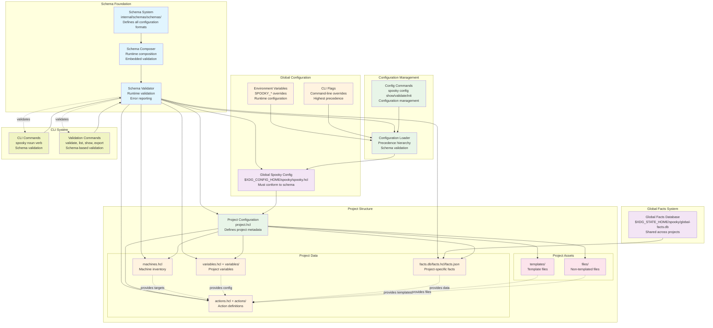
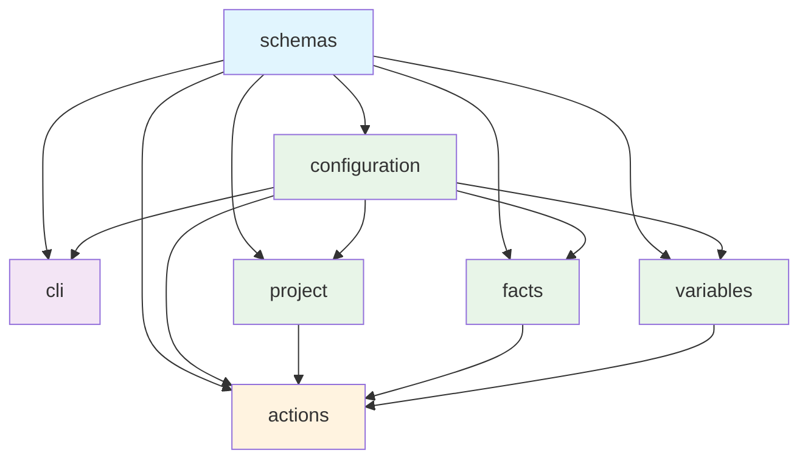

# Spooky Design Document

## Overview

Spooky is a modern infrastructure automation tool designed for simplicity, performance, and reliability. It provides a declarative approach to managing infrastructure through HCL (HashiCorp Configuration Language) configurations, with built-in support for facts collection, variable management, and template rendering.

## Architecture

Spooky follows a layered architecture with clear separation of concerns:

### High-Level Architecture



### System Dependencies



## Core Components

### Schema System
- **Location**: `internal/schemas/schemas/`
- **Purpose**: Defines all configuration formats and validation rules
- **Features**: Embedded schema composition, runtime validation, facts system integration
- **Schema Integration**:
  - **Global Configuration**: Validated against `spooky-config.hcl` schema
  - **Project Configuration**: Validated against `project.hcl` schema
  - **Machine Inventory**: Validated against `machines.hcl` schema
  - **Actions**: Validated against `actions.hcl` schema
  - **Variables**: Validated against `variables.hcl` schema
  - **Facts**: Validated against `facts-badger.hcl`, `facts-json.hcl`, `facts-hcl.hcl` schemas
- **Runtime Composition**: Schemas composed at runtime for flexible validation
- **Embedded Validation**: No external dependencies, schemas embedded in binary
- **Error Reporting**: File and line number precision for validation errors
- **Schema Files**: 
  - `spooky-config.hcl` - Global configuration schema
  - `project.hcl` - Project configuration schema
  - `project-directory.hcl` - Project structure validation
  - `machines.hcl` - Machine inventory schema
  - `actions.hcl` - Action definitions schema
  - `variables.hcl` - Variable definitions schema
  - `facts-badger.hcl` - BadgerDB facts storage schema
  - `facts-json.hcl` - JSON facts storage schema
  - `facts-hcl.hcl` - HCL facts storage schema
- **Validation Example**:
  ```bash
  # Validate project structure
  spooky project validate ./my-project
  # Validates: project.hcl, machines.hcl, actions.hcl, facts.db
  
  # Validate specific components
  spooky machines validate ./my-project
  spooky actions validate ./my-project
  spooky facts validate ./my-project
  ```
- **Integration**: Used by all validation commands (`spooky project validate`, `spooky facts validate`, etc.)
- **Reference**: See [Schema System](../systems/schema-system.md) for detailed implementation

### Configuration System
- **Global Config**: `$XDG_CONFIG_HOME/spooky/spooky.hcl`
- **Project Config**: `project.hcl`
- **Validation**: All configs must conform to embedded schemas
- **Configuration Sections**:
  - **Storage**: BadgerDB/JSON storage settings, compression, encryption
  - **Facts**: Collection timeouts, caching TTL, parallel collection, retry attempts
  - **SSH**: Connection timeouts, keepalive settings, key scanning, host verification
  - **Logging**: Level, format, output destinations, timestamps, colors
  - **Templates**: File size limits, external functions, rendering timeouts, caching
  - **Security**: Unsafe commands, file access restrictions, SSH key validation, audit logging
  - **Performance**: Concurrent actions, memory limits, garbage collection, cache sizes
  - **Development**: Debug mode, profiling, execution tracing
- **Configuration Precedence**: CLI flags → Project config → Global config → Environment variables → Defaults
- **Environment Variables**: `SPOOKY_STORAGE_TYPE`, `SPOOKY_FACTS_TIMEOUT`, `SPOOKY_SSH_TIMEOUT`, `SPOOKY_LOG_LEVEL`, etc.
- **CLI Management**: `spooky config show`, `spooky config validate`, `spooky config init`
- **Schema Files**: `spooky-config.hcl`, `project.hcl`, `machines.hcl`, `actions.hcl`, `variables.hcl`
- **Configuration Example**:
  ```hcl
  # $XDG_CONFIG_HOME/spooky/spooky.hcl
  spooky {
    storage {
      type = "badger"
      path = "$XDG_STATE_HOME/spooky/global-facts.db"
      compression = true
    }
    facts {
      collection_timeout = "30s"
      cache_ttl = "24h"
      parallel_collection = 4
    }
    ssh {
      timeout = "30s"
      keepalive_interval = "60s"
    }
  }
  ```
- **Reference**: See [Configuration System](../systems/configuration-system.md) for detailed implementation

### CLI System
- **Command Pattern**: `spooky noun verb` (e.g., `spooky facts gather`, `spooky actions run`)
- **Configuration Commands**:
  - `spooky config show` - Display current configuration with precedence
  - `spooky config validate` - Validate configuration file syntax and schema
  - `spooky config init` - Create default configuration file
- **Global Flags**: `--config <file>`, `--verbose`, `--quiet`, `--version`
- **Filtering**: `--machine <name|ID>`, `--tags <tags>`, `--filter <query>`
- **Export Formats**: JSON and HCL only, always requires `--output <file>`
- **Validation Commands**: `spooky project validate`, `spooky machines validate`, `spooky actions validate`, `spooky facts validate`
- **Command Examples**:
  ```bash
  # Configuration management
  spooky config show
  spooky config validate $XDG_CONFIG_HOME/spooky/spooky.hcl
  spooky config init
  
  # Facts management
  spooky facts gather ./my-project
  spooky facts list ./my-project --machine "web-001"
  spooky facts export ./my-project --format json --output facts.json
  
  # Actions execution
  spooky actions run ./my-project --parallel 10
  spooky actions list ./my-project --tags "production"
  
  # Project validation
  spooky project validate ./my-project
  spooky machines validate ./my-project
  ```
- **Reference**: See [CLI System](../systems/cli-system.md) for detailed implementation

### Environment Variable Integration
- **Configuration Overrides**: Environment variables can override global and project settings
- **Variable Mapping**:
  - `SPOOKY_STORAGE_TYPE` → `spooky.storage.type`
  - `SPOOKY_STORAGE_PATH` → `spooky.storage.path`
  - `SPOOKY_FACTS_TIMEOUT` → `spooky.facts.collection_timeout`
  - `SPOOKY_FACTS_CACHE_TTL` → `spooky.facts.cache_ttl`
  - `SPOOKY_SSH_TIMEOUT` → `spooky.ssh.timeout`
  - `SPOOKY_SSH_KEEPALIVE` → `spooky.ssh.keepalive_interval`
  - `SPOOKY_LOG_LEVEL` → `spooky.logging.level`
  - `SPOOKY_LOG_FORMAT` → `spooky.logging.format`
  - `SPOOKY_ALLOW_UNSAFE_COMMANDS` → `spooky.security.allow_unsafe_commands`
  - `SPOOKY_RESTRICT_FILE_ACCESS` → `spooky.security.restrict_file_access`
- **Precedence**: Environment variables override global config but are overridden by CLI flags
- **Validation**: Environment variable values validated against schema constraints
- **Integration**: Used by configuration loading system for runtime overrides

### Configuration Precedence and Inheritance
- **Precedence Hierarchy** (highest to lowest priority):
  1. **CLI Flags** - `--ssh-timeout 60s`, `--log-level debug`
  2. **Environment Variables** - `SPOOKY_SSH_TIMEOUT=45s`, `SPOOKY_LOG_LEVEL=warn`
  3. **Project Configuration** - `project.hcl` settings
  4. **Global Configuration** - `$XDG_CONFIG_HOME/spooky/spooky.hcl`
  5. **Default Values** - Built-in sensible defaults
- **Inheritance**: Project config inherits from global config, CLI flags override all
- **Validation**: Each level validated against embedded schemas
- **Error Handling**: Clear error messages for invalid configurations
- **Integration**: Used by all systems (facts, SSH, logging, templates, etc.)

### Facts System
- **Storage**: BadgerDB (default), HCL, JSON
- **Scope**: Global (`$XDG_STATE_HOME/spooky/global-facts.db`) and project-specific
- **Collection**: Via SSH or local access using gopsutil
- **Schema**: Comprehensive system information coverage
- **Custom Facts**: Node-local facts from `/etc/spooky/facts/` (Ansible-inspired approach)
- **Dynamic Facts**: Runtime fact sources with priority-based collision resolution
- **TTL Support**: Configurable time-to-live with change impact assessment
- **Collision Detection**: Machine ID collision detection and resolution strategies
- **Configuration Integration**: Uses global config for storage settings, collection timeouts, parallel limits
- **CLI Integration**: `spooky facts gather`, `spooky facts list`, `spooky facts validate`, `spooky facts export`
- **Reference**: See [Facts System](../systems/facts-system.md) for detailed implementation

### Variables System
- **Storage**: HCL files in project directory (`variables.hcl` and `variables/*.hcl`)
- **Purpose**: Project-specific configuration values and runtime parameters
- **Integration**: Used by actions system for template rendering and configuration
- **Validation**: Schema-based validation with embedded variable schemas
- **File Merging**: Support for single files and directories with strict conflict detection
- **Configuration Integration**: Uses global config for validation settings and file access restrictions
- **CLI Integration**: `spooky variables list`, `spooky variables validate`, `spooky variables export`
- **Reference**: See [Variables System](../systems/variables-system.md) for detailed implementation

### Actions System
- **Definition**: HCL files with command, script, or template actions
- **Execution**: Parallel execution with configurable concurrency
- **Dependencies**: Support for action dependencies and ordering
- **Templates**: Integrated template rendering with facts and variables
- **Configuration Integration**: Uses global config for execution limits, timeouts, security settings
- **CLI Integration**: `spooky actions run`, `spooky actions list`, `spooky actions validate`
- **Reference**: See [Actions System](../systems/actions-system.md) for detailed implementation

## Schema Integration

The schema system provides embedded validation for all configuration components. See [Schema System](../systems/schema-system.md) for detailed implementation, composition approach, and build process.

## Detailed Implementation References

For comprehensive implementation details of each system component, see:

### **Core Systems**
- **[Project System](../systems/project-system.md)** - Complete project system implementation plan with schema validation, configuration precedence, and CLI integration
- **[Schema System](../systems/schema-system.md)** - Schema validation and composition system with embedded runtime validation
- **[Facts System](../systems/facts-system.md)** - Scalable fact storage system with global and project-specific storage, custom facts, and collision detection
- **[Variables System](../systems/variables-system.md)** - Variable management, file merging, dependency resolution, and template integration
- **[Configuration System](../systems/configuration-system.md)** - Global configuration system with XDG compliance, precedence hierarchy, and environment variable support
- **[CLI System](../systems/cli-system.md)** - Command-line interface with noun-verb patterns, validation commands, and configuration management

### **Integration Points**
- **Project Configuration**: Project metadata, isolation, and portability patterns
- **Schema Validation**: Embedded schema composition and runtime validation
- **Variable Management**: File merging, conflict detection, and precedence resolution
- **CLI Integration**: Command patterns, error handling, and global flag support
- **Template System**: Variable access, facts integration, and context management
- **Configuration Management**: Precedence hierarchy, environment variables, and CLI overrides

### **Implementation Patterns**
- **Schema-First Development**: All configuration formats defined by schemas before implementation
- **Embedded Validation**: Runtime schema composition with no external dependencies
- **File Merging**: Support for single files and directories with strict conflict detection
- **Configuration Precedence**: Environment → Project → Global → Defaults hierarchy
- **Error Handling**: Comprehensive error reporting with file and line numbers

## Design Decisions

### 1. Schema-First Development
- All configuration formats defined by schemas before implementation
- Ensures consistency and validation across the system
- Enables tooling and IDE support

### 2. HCL as Primary Language
- Human-readable configuration format
- Rich type system and validation
- Excellent tooling ecosystem

### 3. BadgerDB for Facts Storage
- High-performance key-value store
- ACID transactions and durability
- Native Go implementation

### 4. SSH-First Connectivity
- Standard protocol for remote access
- No agent installation required
- Secure by default

### 5. Template Integration
- Templates embedded in actions system
- Support for facts and variables
- Multiple template engines

### 6. Parallel Execution
- Configurable concurrency levels
- Dependency-aware execution
- Progress tracking and error handling

### 7. File Merging Strategy
- Support for single files and directories
- Strict validation prevents conflicts
- Clear precedence rules

### 8. Error Handling and Resilience
- Comprehensive error reporting
- Graceful handling of network failures
- Retry mechanisms for transient errors

### 9. Embedded Schema Composition
- Runtime schema composition for flexibility
- Ensures schema consistency across formats
- Maintains embeddability and performance

### 10. No Backward Compatibility
- Freedom to evolve the system
- No legacy code maintenance burden
- Clean, modern architecture

### 11. XDG Base Directory Compliance
- Standard configuration locations
- Cross-platform compatibility
- User-specific and system-wide settings

### 12. Configuration Precedence
- Clear hierarchy for configuration sources
- Environment variable support
- CLI flag overrides
- Sensible defaults

## File Merging Rules

## File Merging and Conflict Resolution

Spooky supports merging configuration from multiple files with strict validation:

- **Machine Inventory**: `machines.hcl` and `machines/*.hcl` files
- **Variables**: `variables.hcl` and `variables/*.hcl` files  
- **Actions**: `actions.hcl` and `actions/*.hcl` files

All file merging follows strict conflict detection and resolution rules. See [Variables System](../systems/variables-system.md) for detailed variable file merging rules and conflict resolution strategies.