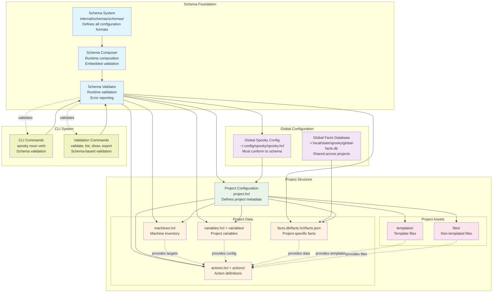
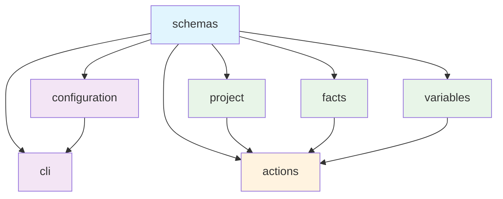

# Spooky Design Document

## Overview

Spooky is a modern infrastructure automation tool designed for simplicity, performance, and reliability. It provides a declarative approach to managing infrastructure through HCL (HashiCorp Configuration Language) configurations, with built-in support for facts collection, variable management, and template rendering.

## Architecture

Spooky follows a layered architecture with clear separation of concerns:

### High-Level Architecture

### System Dependencies

## Core Components

### Schema System
- **Location**: `internal/schemas/schemas/`
- **Purpose**: Defines all configuration formats and validation rules
- **Features**: Embedded schema composition, runtime validation, facts system integration
- **Integration**: Used by all validation commands (`spooky validate`, `spooky facts validate`, etc.)
- **Reference**: See [Schema System](../systems/schema-system.md) for detailed implementation

### Configuration System
- **Global Config**: `~/.config/spooky/spooky.hcl`
- **Project Config**: `project.hcl`
- **Validation**: All configs must conform to embedded schemas

### Facts System
- **Storage**: BadgerDB (default), HCL, JSON
- **Scope**: Global (`~/.local/state/spooky/global-facts.db`) and project-specific
- **Collection**: Via SSH or local access using gopsutil
- **Schema**: Comprehensive system information coverage

### Variables System
- **Storage**: HCL files in project directory (`variables.hcl` and `variables/*.hcl`)
- **Purpose**: Project-specific configuration values and runtime parameters
- **Integration**: Used by actions system for template rendering and configuration
- **Validation**: Schema-based validation with embedded variable schemas
- **Reference**: See [Variables System](../systems/variables-system.md) for detailed implementation

### Actions System
- **Definition**: HCL files with command, script, or template actions
- **Execution**: Parallel execution with configurable concurrency
- **Dependencies**: Support for action dependencies and ordering
- **Templates**: Integrated template rendering with facts and variables

## Schema Integration

The schema system provides embedded validation for all configuration components. See [Schema System](../systems/schema-system.md) for detailed implementation, composition approach, and build process.

## Detailed Implementation References

For comprehensive implementation details of each system component, see:

### **Core Systems**
- **[Project System](../systems/project-system.md)** - Complete project system implementation plan with schema validation, configuration precedence, and CLI integration
- **[Schema System](../systems/schema-system.md)** - Schema validation and composition system with embedded runtime validation
- **[Variables System](../systems/variables-system.md)** - Variable management, file merging, dependency resolution, and template integration

### **Integration Points**
- **Project Configuration**: Project metadata, isolation, and portability patterns
- **Schema Validation**: Embedded schema composition and runtime validation
- **Variable Management**: File merging, conflict detection, and precedence resolution
- **CLI Integration**: Command patterns, error handling, and global flag support
- **Template System**: Variable access, facts integration, and context management

### **Implementation Patterns**
- **Schema-First Development**: All configuration formats defined by schemas before implementation
- **Embedded Validation**: Runtime schema composition with no external dependencies
- **File Merging**: Support for single files and directories with strict conflict detection
- **Configuration Precedence**: Environment → Project → Global → Defaults hierarchy
- **Error Handling**: Comprehensive error reporting with file and line numbers

## Design Decisions

### 1. Schema-First Development
- All configuration formats defined by schemas before implementation
- Ensures consistency and validation across the system
- Enables tooling and IDE support

### 2. HCL as Primary Language
- Human-readable configuration format
- Rich type system and validation
- Excellent tooling ecosystem

### 3. BadgerDB for Facts Storage
- High-performance key-value store
- ACID transactions and durability
- Native Go implementation

### 4. SSH-First Connectivity
- Standard protocol for remote access
- No agent installation required
- Secure by default

### 5. Template Integration
- Templates embedded in actions system
- Support for facts and variables
- Multiple template engines

### 6. Parallel Execution
- Configurable concurrency levels
- Dependency-aware execution
- Progress tracking and error handling

### 7. File Merging Strategy
- Support for single files and directories
- Strict validation prevents conflicts
- Clear precedence rules

### 8. Error Handling and Resilience
- Comprehensive error reporting
- Graceful handling of network failures
- Retry mechanisms for transient errors

### 9. Embedded Schema Composition
- Runtime schema composition for flexibility
- Ensures schema consistency across formats
- Maintains embeddability and performance

### 10. No Backward Compatibility
- Freedom to evolve the system
- No legacy code maintenance burden
- Clean, modern architecture

## File Merging Rules

## File Merging and Conflict Resolution

Spooky supports merging configuration from multiple files with strict validation:

- **Machine Inventory**: `machines.hcl` and `machines/*.hcl` files
- **Variables**: `variables.hcl` and `variables/*.hcl` files  
- **Actions**: `actions.hcl` and `actions/*.hcl` files

All file merging follows strict conflict detection and resolution rules. See [Variables System](../systems/variables-system.md) for detailed variable file merging rules and conflict resolution strategies.